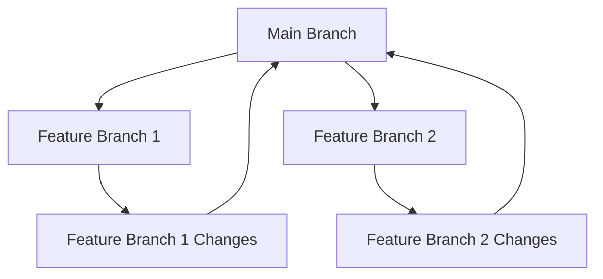
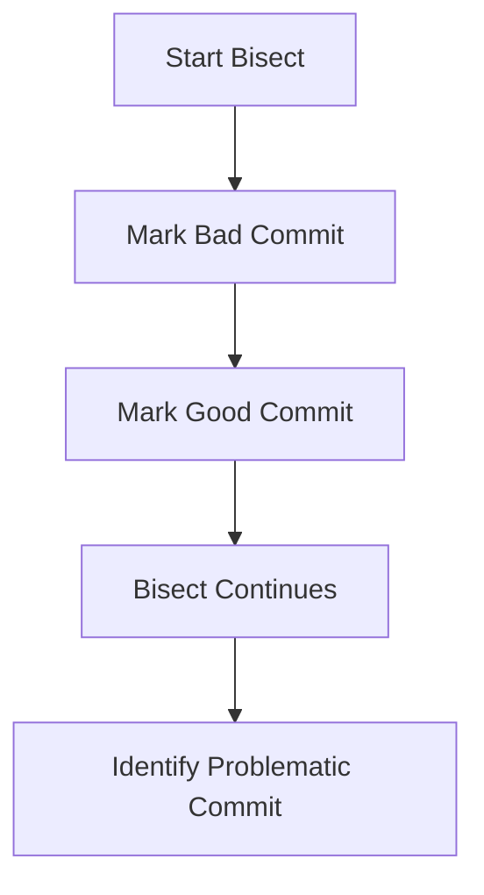
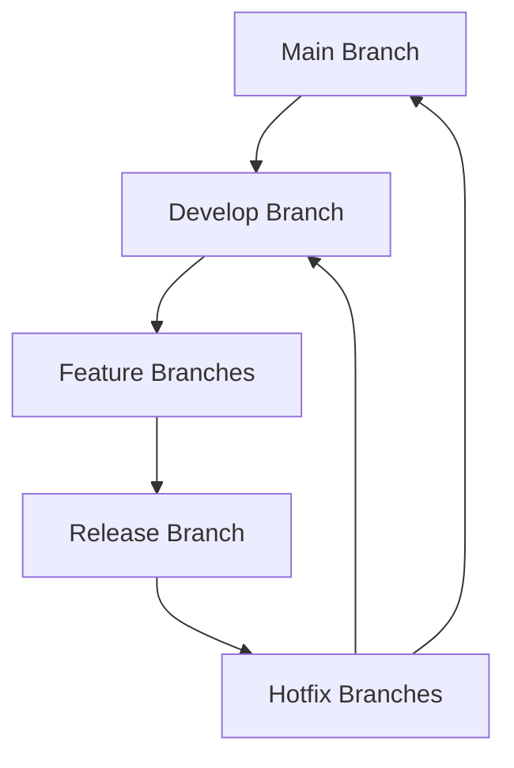

# Git Mastery: From Beginner to Pro

Welcome to my journey of mastering Git, the essential version control system for developers. This repository documents my progress and serves as a reference for anyone looking to learn Git from the ground up.

## Table of Contents
- [Getting Started](#getting-started)
- [Basic Commands](#basic-commands)
- [Branching and Merging](#branching-and-merging)
- [Collaborating with Git](#collaborating-with-git)
- [Advanced Techniques](#advanced-techniques)
- [Best Practices](#best-practices)
- [Example Workflow with Git and GitHub](#example-workflow-with-git-and-github)
- [References](#references)

## Getting Started
Version control systems like Git are crucial for modern development, enabling developers to track changes, collaborate efficiently, and maintain a clean project history. Here’s how to get started with Git:

### Installing Git
To use Git, you need to install it on your system. Installation varies depending on your operating system.

**On Ubuntu/Debian:**
```bash
sudo apt-get update
sudo apt-get install git
```

**On macOS (using Homebrew):**
```bash
brew install git
```

**On Windows:**
Download and install Git from [git-scm.com](https://git-scm.com/download/win).

### Setting Up Initial Configuration
After installing Git, configure your user name and email address. These details are used in your commits.

```bash
# Set up your name
git config --global user.name "Your Name"

# Set up your email address
git config --global user.email "your.email@example.com"
```

## Basic Commands
These are the fundamental commands you need to start using Git effectively.

### `git init`
Initialize a new Git repository in the current directory. This creates a `.git` directory that stores all the version control information.

```bash
# Initialize a new Git repository
git init
```

### `git add`
Stage changes to the staging area. This prepares files to be committed.

```bash
# Stage all changes
git add .

# Stage specific files
git add file1.txt file2.txt
```

### `git commit`
Save the staged changes to the repository with a meaningful commit message.

```bash
# Commit staged changes
git commit -m "Describe what you have done in this commit"
```

### `git status`
Check the status of your working directory and staging area. This shows which changes are staged, unstaged, or untracked.

```bash
# Check the status of the repository
git status
```

### `git log`
View the commit history. This shows a list of commits along with their messages and metadata.

```bash
# View commit history
git log
```

## Branching and Merging
Branching and merging are essential for managing different lines of development in your project.

### Creating and Managing Branches
Use branches to develop features or fix bugs without affecting the main codebase.

**Create a new branch:**
```bash
git branch feature-branch
```

**Switch to a branch:**
```bash
git checkout feature-branch
```

**Create and switch to a new branch in one command:**
```bash
git checkout -b feature-branch
```

### Merging Branches
Integrate changes from one branch into another using `git merge`.

**Merge a branch into the main branch:**
```bash
# Switch to the main branch
git checkout main

# Merge changes from the feature branch
git merge feature-branch
```

### Rebasing
Rebase is an alternative to merging that applies your changes on top of another branch.

**Rebase a feature branch onto the main branch:**
```bash
# Switch to the feature branch
git checkout feature-branch

# Rebase onto the main branch
git rebase main
```

**Diagram: Git Branching and Merging**



## Collaborating with Git
Collaborating with others involves sharing your changes and incorporating others' work into your own.

### Cloning Repositories
Create a local copy of a remote repository.

```bash
# Clone a repository
git clone https://github.com/username/repository.git
```

### Pulling and Pushing Changes
Synchronize your local repository with the remote repository.

**Pull updates from the remote repository:**
```bash
# Fetch and merge changes from the remote main branch
git pull origin main
```

**Push your changes to the remote repository:**
```bash
# Push changes to the remote main branch
git push origin main
```

### Managing Remote Repositories
View and manage remote repositories.

**View remote repositories:**
```bash
# List remote repositories
git remote -v
```

**Add a new remote repository:**
```bash
# Add a new remote repository
git remote add origin https://github.com/username/repository.git
```

## Advanced Techniques
Explore advanced Git features to streamline your workflow and troubleshoot issues.

### Interactive Rebasing
Edit, reorder, or squash commits with interactive rebasing.

**Start interactive rebase:**
```bash
# Rebase the last 3 commits interactively
git rebase -i HEAD~3
```

### Stashing Changes
Temporarily shelve changes you are not ready to commit.

**Stash changes:**
```bash
git stash
```

**Apply stashed changes:**
```bash
git stash apply
```

### Bisecting Commits
Identify problematic commits using binary search.

**Start bisecting:**
```bash
# Start bisecting to find a bad commit
git bisect start

# Mark the current commit as bad
git bisect bad

# Mark a known good commit
git bisect good <commit-hash>
```

### Implementing Hooks
Automate tasks with Git hooks.

**Example: pre-commit hook to run tests:**
```bash
# Create a pre-commit hook
echo -e "#!/bin/sh\nnpm test" > .git/hooks/pre-commit

# Make the hook executable
chmod +x .git/hooks/pre-commit
```

**Diagram: Git Bisect Workflow**



## Best Practices
Adopting best practices ensures efficient use of Git and a clean project history.

### Writing Clear Commit Messages
Craft meaningful commit messages to describe changes effectively.

**Example of a good commit message:**
```text
feat: add user authentication

Added user authentication feature including login, registration, and password recovery.
```

### Regularly Pushing Changes
Avoid conflicts by pushing changes frequently.

**Example:**
```bash
# Add changes to the staging area
git add .

# Commit changes with a message
git commit -m "Update README with examples"

# Push changes to the remote repository
git push origin feature-branch
```

### Reviewing Branching Strategy
Understand and follow the project's branching strategy, such as Git Flow or GitHub Flow.

**Diagram: Git Flow Workflow**



## Example Workflow with Git and GitHub

Here’s a practical example of a typical workflow using Git and GitHub:

```bash
# Create a new repository on GitHub

# Initialize a new Git repository locally
git init

# Add a new remote origin pointing to GitHub
git remote add origin https://github.com/username/repository.git

# Add files to the staging area
git add .

# Commit the changes
git commit -m "Initial commit"

# Push the changes to GitHub
git push -u origin main
```

## References
Here are some valuable resources for learning Git:

- **Pro Git** by Scott Chacon and Ben Straub (book)
- **Git Documentation**: [https://git-scm.com/doc](https://git-scm.com/doc)
- **Atlassian Git Tutorials**: [https://www.atlassian.com/git/tutorials](https://www.atlassian.com/git/tutorials)
- **Git Branching Strategies**: [https://nvie.com/posts/a-successful-git-branching-model/](https://nvie.com/posts/a-successful-git-branching-model/)
- **GitHub Guides**: [https://guides.github.com/](https://guides.github.com/)
